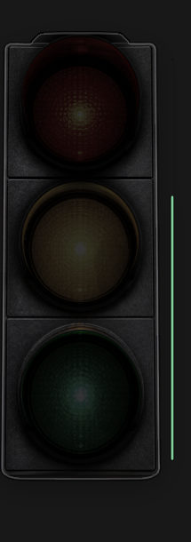

# codex-status-light

一个 macOS 桌面悬浮状态灯，用来显示 Codex 当前工作状态。



## 一键安装

把下面这一行复制给 Codex 或终端执行，它会自动下载安装到 `~/.codex/codex-status-light`，并完成编译、立即启动、开机自启、命令安装和 Codex hooks 配置：

```bash
/bin/zsh -lc 'set -e; d="$HOME/.codex/codex-status-light"; if [ -d "$d/.git" ]; then git -C "$d" pull --ff-only; else mkdir -p "$(dirname "$d")"; git clone https://github.com/liuqq666/coding-traffic-light.git "$d"; fi; cd "$d"; ./install.command'
```

首次使用或 hook 命令确实发生变化时，Codex 会要求你信任。出现提示时，在 Codex 里运行 `/hooks`，按提示确认即可。重复运行安装脚本会保留现有 hook 和信任状态，不会重复写入配置。

## 状态

- 黄灯：存在活跃 working 会话，表示 Codex 正在工作；working 会话即使已点击查看，也会保持黄灯，直到会话 done/idle 或超过会话过期时间。
- 绿灯：存在未查看 done 会话，表示有结果待验收；绿灯不会 10 分钟自动变暗，会一直保持到你点击打开/标记已查看，或会话被清理、归档、不可打开。
- 红灯：存在未查看 waiting 会话，表示真正等待用户动作；waiting 不按时间自动过期，只按已查看、可打开、归档状态过滤。
- 多个状态可以同时存在，对应的红、黄、绿灯可以同时亮。
- 全暗：空闲。

状态文件：

```text
~/Library/Application Support/CodexStatusLight/state.json
```

偏好设置：

```text
~/Library/Application Support/CodexStatusLight/preferences.json
```

## 手动安装

下载后双击根目录里的：

```text
install.command
```

它会自动完成：

- 编译并安装悬浮灯。
- 立即启动并显示悬浮灯。
- 设置开机自动启动。
- 安装 `codex-light` / `codex-light-run` / `codex-light-hook` 命令。
- 把 Codex hooks 写入 `~/.codex/config.toml`。
- 自动合并并去重旧版 CodexStatusLight hooks；已有的唯一 hook 会原位保留，避免更新后反复丢失信任。
- Codex hook 收到事件时会自动拉起状态灯；如果状态灯没在运行，打开 Codex 后第一次会话活动会把它启动。

也可以用命令行安装：

```bash
git clone https://github.com/liuqq666/coding-traffic-light.git
cd coding-traffic-light
./install.command
```

如果命令找不到，把这一行加入 `~/.zshrc`：

```bash
export PATH="$HOME/.codex/bin:$PATH"
```

## 打开

安装后会自动启动悬浮灯。之后快速启动可以双击根目录里的：

```text
start.command
```

或运行：

```bash
codex-light show
```

如果 launch agent 被停掉，也可以强制拉起：

```bash
launchctl kickstart -k "gui/$(id -u)/com.liuqq666.codex-status-light"
codex-light show
```

### 和 Codex 一起启动

安装脚本会配置两层自动启动：

- macOS 登录时通过 LaunchAgent 自动启动。
- Codex hooks 被信任后，Codex 的第一次会话活动会自动拉起状态灯；如果状态灯已退出，后续 Codex 事件也会再次拉起。

首次使用或 hook 命令确实变化时，仍需要在 Codex 里运行一次 `/hooks` 并确认信任。这是 Codex 对本地 command hooks 的安全确认，项目脚本不会绕过。普通升级会保留原 hook 的位置和信任状态。

## 命令行控制

```bash
codex-light working
codex-light done
codex-light waiting
codex-light idle
codex-light status
codex-light quit
codex-light show
codex-light settings
codex-light reset-position
codex-light clear-sessions
```

不带 `--session` 的 `working` / `done` / `waiting` / `idle` 是手动全局状态，会清空旧 sessions，避免旧会话继续影响聚合。

如果悬浮灯没有出现在屏幕上，先试：

```bash
codex-light reset-position
codex-light show
```

也可以包一层运行命令：

```bash
codex-light-run npm run build
codex-light-run python3 script.py
```

规则：

- 命令开始：黄灯。
- 命令成功：绿灯。
- 命令失败：红灯。

## 接入 Codex hooks

安装脚本会自动把 `examples/codex-hooks.example.toml` 合并到 `~/.codex/config.toml`，并清理旧版本遗留的尾部重复项。已经正确安装时，脚本不会重写配置文件。
首次安装或 hook 命令变化后，在 Codex 里运行一次 `/hooks`，按提示信任这些 hooks。

规则：

- `UserPromptSubmit` / `PreToolUse`：黄灯，记录 working。
- `PermissionRequest`：红灯，记录 waiting。
- `Stop` / `SubagentStop`：绿灯，一律记录 done；不会再根据最后回复文本猜测 waiting。
- hooks 会记录会话 id、工作目录、事件来源、工具名和一段摘要，用于右键会话菜单。
- hooks 会在更新状态前自动确认状态灯进程已启动。
- 如果 transcript 里已有 `token_count`，会记录 5 小时额度余量和重刷时间。

多会话按独立会话管理：

- 每个 Codex 会话按 `session_id` 单独记录 `state`、`updated_at`、`acknowledged_at` 和摘要信息。
- 只管理非归档、可打开的 UUID 会话；非 UUID fallback/test session 不会抢状态或抢点击。
- working 会话按 `session_stale_seconds` 过滤，默认 6 小时。
- done / waiting 不按 TTL 自动过期。
- 未查看 waiting 会话点亮红灯。
- 活跃 working 会话点亮黄灯，即使已查看也会继续亮。
- 未查看 done 会话点亮绿灯。
- 多个状态同时存在时，对应的多个灯会同时亮。
- 打开 done / waiting 会话后会写入 `acknowledged_at`，这条会话不再点亮待处理灯；working 会话打开后仍可保持黄灯。
- 单值状态仍保留在 `state.json` 和 `codex-light status` 里，用于 tooltip、声音和兜底，优先级为 waiting > done > working > idle。

## 交互

- 单击某个灯面：优先打开该颜色对应状态下最新未查看 Codex 会话；没有未查看会话时，fallback 到该状态下最新活跃会话。
- 右键某个灯面：列出该状态下所有非归档活跃会话，可以选择打开或全部标记已查看。
- 点击打开会话后，如果开启 `click_acknowledges_sessions`，会把这条会话标记为已查看；后续有新事件时会重新提醒。
- 右键灯外：打开全局菜单，可以切换状态、调整大小、设置闪烁、打开设置窗口、静音或退出。
- 右侧额度细线：吸附在灯壳边缘显示剩余额度；hover tooltip 会显示 5 小时窗口和本地重刷时间，可在全局菜单或设置窗口关闭，默认开启。
- 左下角拖拽：按比例缩放浮窗。

### 侧边吸附

- 把悬浮灯拖到屏幕左侧或右侧边缘松手，会自动吸附到对应侧边。
- 吸附后会切换成像素风侧边红绿灯，只显示三个紧挨着的小方块：上红、中黄、下绿。
- 未亮的方块会接近黑色，只保留很弱的底色；当前状态方块会明显点亮，仍沿用红灯等待、黄灯工作、绿灯完成的含义。
- 从屏幕边缘把小方块拖出来，会自动恢复完整状态灯。
- 右键灯外也可以手动选择「吸附到左侧」「吸附到右侧」，侧边模式下可选「展开完整灯」。
- 侧边模式会记住吸附的屏幕边缘和垂直位置；调整大小时会保持贴边。

## 设置

右键菜单里打开「设置...」可以调整：

- 浮窗大小。
- 点击会话后是否停止闪烁。
- 红灯未处理后是否自动加快。
- 是否显示额度条。
- 红灯加快阈值。
- 会话过期时间。
- 静音、找回浮窗、清空会话。

## 卸载

```bash
./scripts/uninstall.command
```

## 第一版范围

- 原生 macOS 悬浮窗。
- 可拖动，位置会保存。
- 单击或右键菜单可放大、缩小、重置大小，大小会保存。
- 始终置顶，可跨 Space 显示。
- 双击循环切换状态。
- 右键菜单切换状态、打开会话列表和设置。
- 命令行和 Codex hooks 控制状态。
- 静音按钮，设置会保存。
